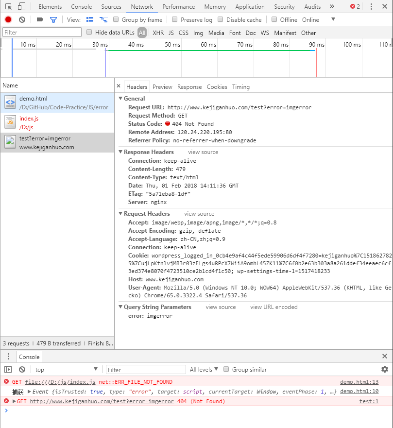

# JavaScript-异常监控

* 前端错误的分类
* 错误的捕获方式
* 上报错误的基本原理

## 1、前端错误的分类

* 即时运行错误：代码错误
* 资源加载错误

## 2、错误的捕获方式

### 即时运行错误捕获方式

1. try...catch 
2. window.onerror

### 资源加载错误

1. object.onerror 
2. performance.getEntries 
3. Error事件捕获

* 资源加载错误事件不会冒泡，只会在本身这个object报错事件进行响应
* performace.getEntries\(\)这个API获取所有资源的加载地址


* Error事件捕获

```markup
<!DOCTYPE html>
<html>
  <head>
    <meta charset="utf-8">
    <title></title>
  </head>
  <body>
    <script type="text/javascript">
      window.addEventListener('error',function (e) {
        console.log('捕获',e);
      }, true);
    </script>
    <script src="/js/index.js" charset="utf-8"></script>
  </body>
</html>
```


### 跨域资源加载错误

1. 在script标签增加crossorigin属性（客户端错误）
2. 设置JS资源响应头Access-Control-Allow-Origin:\*（服务端做）

## 3、错误监控

* 上报错误的基本原理
  * 使用Ajax通信进行上报
  * 利用Image对象上报

```markup
<!DOCTYPE html>
<html>
  <head>
    <meta charset="utf-8">
    <title></title>
  </head>
  <body>
    <script type="text/javascript">
      window.addEventListener('error',function (e) {
        console.log('捕获',e);
      }, true);
    </script>
    <script src="/js/index.js" charset="utf-8"></script>
    <script type="text/javascript">
      let errors = 'imgerror';
      (new Image()).src = `http://www.kejiganhuo.com/test?error=${errors}`;
    </script>
  </body>
</html>
```



